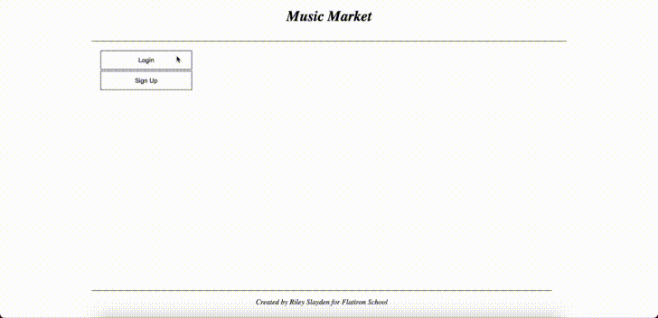

<div align="center">
<h1>🎸 Music Market 🎻</h1>
<p>A marketplace for anyone wanting to sell their new or used instruments</p>

<hr/>
<p>
  Explore:
  <a href="https://www.youtube.com/watch?v=6UhS9__NFjQ&t=3s&ab_channel=RileySlayden">VIDEO DEMO</a>
  </p>
</div>

## Overview
This app is a marketplace for anyone wanting to sell used instruments! It uses a Rails API backend with a vanilla Javascript frontend, and is a SPA (single page application). Users can create, edit, and delete their account and listings, as well as save favorites.

## Inspiration

Continuing with my music project theme, I thought it would be fun to build a "Craigslist" type marketplace for used musical instruments. The sole purpose of this project was to build my fundamental Javascript skills before moving into React. Overall, building an SPA in vanilla Javascript was a great exercise, but looking back, it sure does make me appreciate modern Javascript libraries (such as React).

## Installation
1. Fork and clone this repository, and then within the backend directory execute:
```
$ bundle install
$ rake db:migrate
```
2. Seed some data to begin:
```
$ rake db:seed
```
3. Then run:
```
$ rails s
```
4. Navigate to the frontend directory and run:
```
open index.html
```
5. Create an account and log in to see other postings and create your own.

## Contact
👨‍💻 [LinkedIn](https://linkedin.com/in/rileyslayden) <br/>
‍💻 [Portfolio](https://www.rileyslayden.com) <br/>
📧 Email: slaydenriley@gmail.com

### Contributors
Contributions are welcome, and can be made by either opening an issue or making a pull request to this repo.

### License
The full [MIT license](https://github.com/ddhogan/starfleeter/blob/master/LICENSE) can be found in this repo.
